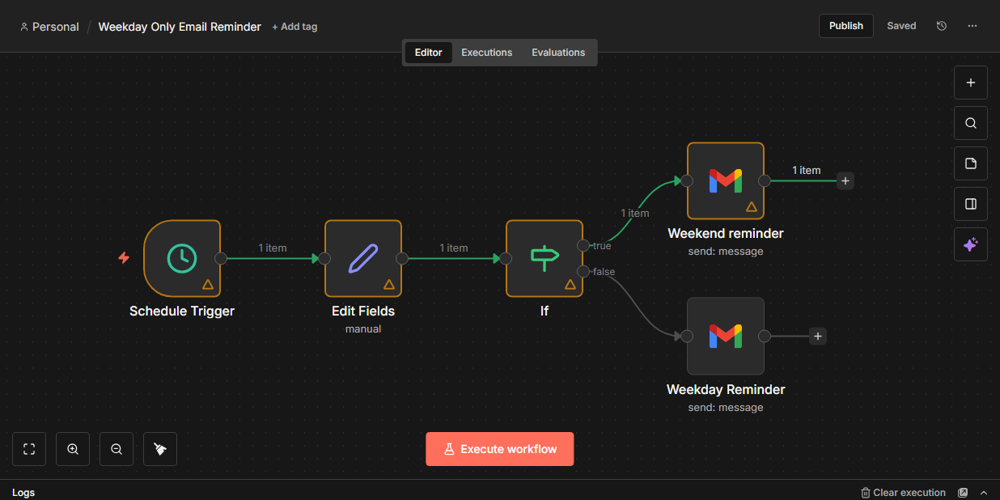

# Weekday Only Email Reminder (n8n)

This automation sends different email reminders depending on whether the day is a weekday or weekend.

## Workflow Overview
- Runs every day at 9:00 AM
- Checks the current day
- Sends a motivational email on weekdays
- Sends a relaxed message on weekends

## Nodes Used
- Schedule Trigger
- Set
- IF
- Gmail

## Logic Used
The workflow checks the current day using an IF condition:
- Monday–Friday → Weekday email
- Saturday–Sunday → Weekend email

## Screenshot

## Status
Completed – Beginner n8n Project
